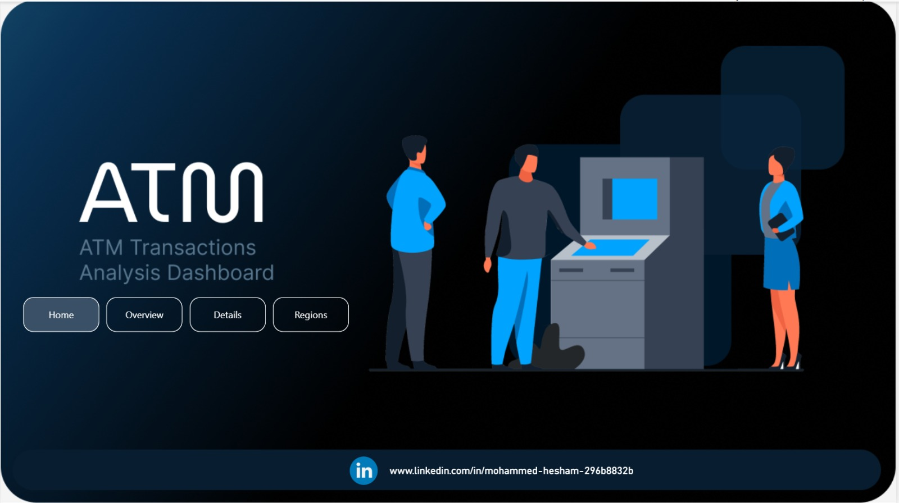
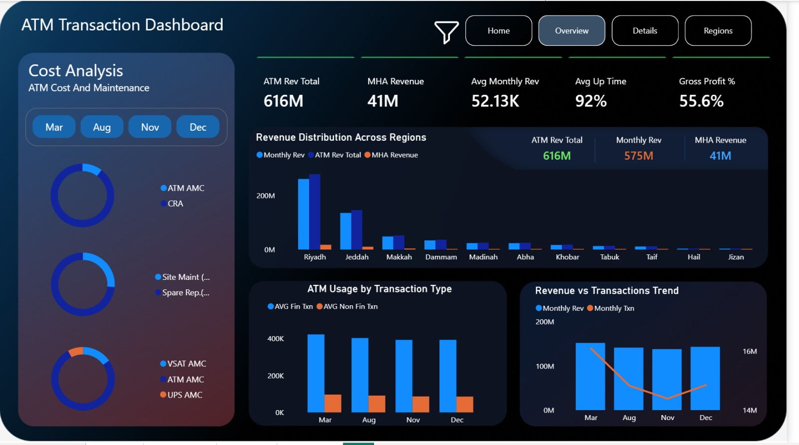
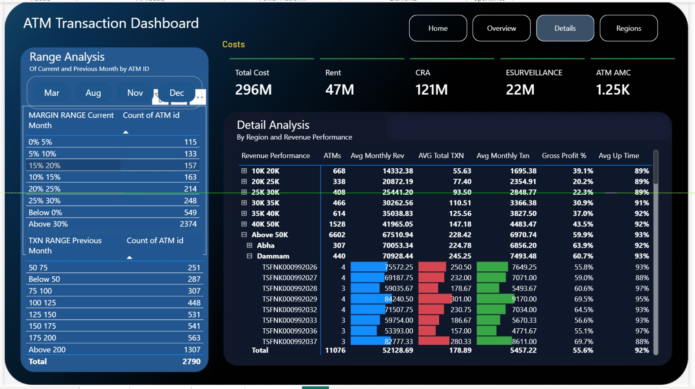
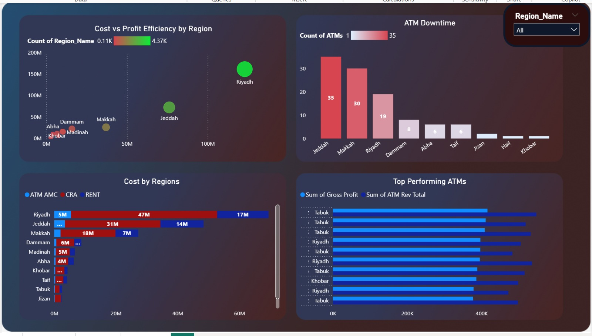

# ATM Performance Dashboard

This project analyzes ATM operations, revenue, costs, and performance across different regions using Power BI.

## 📊 Key Insights

- Revenue is highly concentrated in key regions, with Riyadh and Jeddah leading.
- Revenue is influenced by transaction type and fixed income, not just transaction volume.
- Operational costs remain relatively consistent across regions.
- ATM maintenance (AMC) is the highest maintenance cost, while UPS contributes the least.
- Cash replenishment (CRA) exceeds maintenance costs, making it a primary cost driver.
- Site maintenance drives more operational cost than equipment repairs.
- Some regions have a higher number of underperforming ATMs based on uptime.
- Riyadh and Jeddah remain the most profitable despite high costs, with margins up to 100%.
- Tabuk stands out with the top-performing ATMs despite lower overall regional performance.
- Jeddah and Makkah show repeated ATM downtime across multiple months, indicating persistent issues.

## 📷 Dashboard Preview

### Home

### Overview

### Uptime Analysis

### Cost Analysis

## 🛠 Tools Used

- Power BI
- Excel
- DAX
- Figma
- Mokkupp
